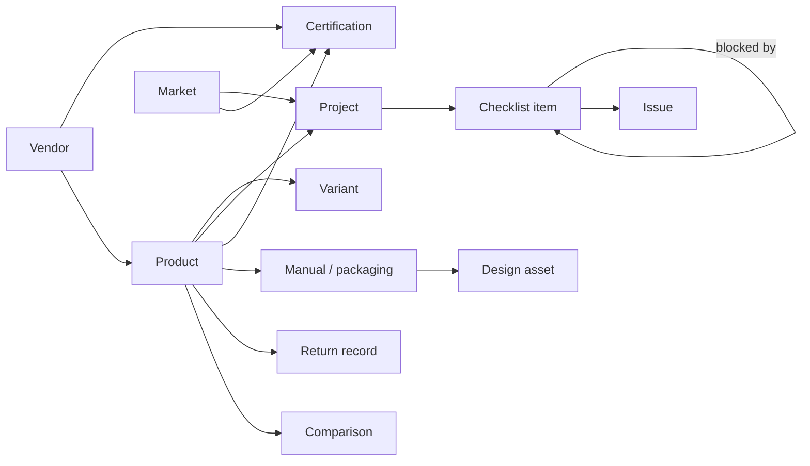

# Aether Platform Roadmap

Sep 23, 2026 · Brayden

## Purpose and scope

Aether is Luna's product-readiness hub: one place to see where every product stands on its way to market, what is blocking it, and who owns the next step. It is not a task manager. It is a checklist-and-status layer over products, markets and projects, so the boss can see state at a glance.

Aether pulls shared data from Odyssey (catalog, test results, vendors) and holds its own data for Luna-only work: market launches, certifications, manuals, competitive research and return analytics.

**First workflows, in priority order:**

1. **Product and market launch tracking** — e.g. "Where are we on selling the Lightbulb Camera in the UK?" Checklists per product × market, with states, issues and blocker links.
2. **Certification and compliance tracking** — CE/UKCA/FCC and similar, per product and market, with evidence and expiry dates.
3. **Manual and packaging management** — versions per product and region, with design assets and approval state.
4. **Returns analytics** — catalog Amazon and TikTok return codes and reasons by product, to spot defects and trends.
5. **Competitive analysis** — comparisons of Luna products against what is on the market.

## Team roles

Five roles to start, 5–10 users total. Everyone sees everything; roles control what each person can edit.

| Role | Owns | Needs from Aether | App role |
| --- | --- | --- | --- |
| Boss | Oversight of all work | Dashboard of every project, state and blocker; read everything | Admin |
| Product Development (Brayden) | Certifications, manuals, product testing, app feedback, new products, market research, project management | Create and run projects and checklists, log issues and blockers, comparisons, push catalog to Odyssey | Admin |
| International Expansion | Market entry: certifications, packaging and manual changes, regional variants (e.g. plug type on power bricks) | Product × market checklists, variant records, cert tracking | Editor |
| Design | Images, graphics, renders for manuals and ads | Asset requests tied to manuals and products, upload and version assets | Editor |
| E-commerce (Amazon/TikTok) | Sales, affiliates, ads, returns | Return code logging and trends, listing readiness per product | Editor |

A read-only **Viewer** role covers anyone added later, such as contractors or leadership outside Luna.

## Modules

Six modules carry over or adapt from Odyssey; five are new to Aether. Issues and Comparisons are provisional pending discussion.

| Module | Source | Treatment | Notes |
| --- | --- | --- | --- |
| Catalog | Odyssey | Shared, two-way | Read Odyssey's products; create Luna products in Aether and send them to Odyssey |
| Test sessions | Odyssey | Read-only | Show results on product and project pages as evidence for readiness |
| Vendors | Odyssey | Adapted | Product-dev vendors: manufacturers, cert labs, packaging, translation |
| Projects | Odyssey | Expanded | Becomes the core: projects with checklists, states, blockers and dependencies |
| Issues | Odyssey | TBD | Proposed: lightweight issues attached to checklist items, not a full tracker |
| Comparisons | Odyssey | TBD | Proposed: competitive analysis of Luna vs market products |
| Markets | New | — | Countries/regions with plug type, voltage, required marks, languages |
| Certifications | New | — | Cert per product × market: status, lab, cert number, expiry, documents |
| Manuals and packaging | New | — | Versioned per product and region, linked to design assets and approvals |
| Returns | New | — | Return codes and reasons from Amazon/TikTok, by product and period |
| Dashboard | New | — | Boss view: every project's state, overdue items and open blockers |

## Data model sketch

The spine is **Product × Market → Project → Checklist items**, with blockers as links between items. Everything else hangs off products and markets.

Each checklist item links to the items it waits on, so the dashboard can show the critical path for a launch.

| Entity | Key fields |
| --- | --- |
| Product | name, SKU, category, lifecycle stage, odyssey_id (nullable), source (odyssey/aether) |
| Variant | product, market, differences (plug, packaging, language), SKU |
| Market | country/region, plug type, voltage, required marks, languages |
| Project | name, product, market (optional), type (launch, new product, app feature), owner, state, target date |
| Checklist item | project, title, category (cert, manual, packaging, testing, listing), owner, state, due date, evidence link |
| Dependency | item, blocked_by_item |
| Issue | item or project, description, severity, state, opened/closed dates |
| Certification | product, market, mark (CE, UKCA, FCC…), lab vendor, state, cert number, issued/expiry dates, files |
| Manual / packaging | product, region, type, version, state (draft, in design, review, approved), file |
| Design asset | manual or product, type (image, render, graphic), file, version, requested by |
| Return record | product, channel (Amazon/TikTok), return code, reason text, quantity, date, order ref |
| Comparison | Luna product, competitor products, attributes, notes |
| Vendor | name, type, contacts, products, odyssey_id (nullable) |
| User | name, email, role, auth provider |
| Activity log | entity, change, user, timestamp (audit trail for every state change) |

States are one shared set for projects and items: Not started, In progress, Blocked, In review, Done.

## Odyssey integration

Aether keeps its own database and talks to Odyssey over an API, not a shared database. This keeps the two apps independent and survives a move of either one from Railway to Azure.

- **Pull from Odyssey:** products, test session results and vendors, synced on a schedule (e.g. every 15 minutes) plus an on-demand refresh button. Synced records are read-only in Aether and keep their `odyssey_id`.
- **Push to Odyssey:** products created in Aether are sent to Odyssey's catalog with one action; Odyssey's ID is stored back on the Aether record.
- **Auth between apps:** a service API key per app, stored as an environment variable.
- **Odyssey changes needed:** a small set of API endpoints (list/get products, test sessions, vendors; create product), if they don't already exist.

If Odyssey is unreachable, Aether keeps working on its last synced copy and shows when data was last refreshed.

## Platform decisions

Defaults favor a small team now and an easy path to scale later.

| Area | Decision | Revisit when |
| --- | --- | --- |
| Sign-in | Google sign-in plus email/password; admin invites users | SSO or domain restriction is needed |
| Roles | Admin, Editor, Viewer, carried over from Odyssey's auth layer | A role needs finer permissions |
| Hosting | Railway, same as Odyssey | Odyssey moves to Azure |
| Database | Postgres with versioned migrations | — |
| Environments | Production only, plus local dev | Users grow past ~10 or outside users are added |
| CI | GitHub Actions: lint and tests on every PR, deploy on merge to main | — |
| Files | Object storage (Railway volume or S3-compatible) for certs, manuals, assets | Files outgrow the volume |
| Look and feel | Clean, neutral UI; no space theme; light and dark mode | A brand direction is chosen |
| Integrations | None at launch; Slack notifications and Google Drive are likely first candidates | The team names a need |

## Phased roadmap

Five phases, each shippable on its own. Phase 1 alone answers "where are we on the UK Lightbulb Camera launch?"

| Phase | Scope | Done when |
| --- | --- | --- |
| 0. Foundation | Repo on `claude/aether-platform-infrastructure-c08uu9`: frontend and backend folders, Postgres migrations, auth and roles from Odyssey, `.env.example`, CI, README, deploy to Railway | A user can sign in with Google or email and see an empty app |
| 1. Products, markets and launch tracking | Catalog (local + Odyssey read), markets, projects, checklist items, states, blockers, activity log, boss dashboard | A UK launch project shows every item, its owner, state and what blocks it |
| 2. Certifications and manuals | Certification records with files and expiry alerts; manual/packaging versions; design asset requests; variants per market | Cert and manual status for any product × market is visible in one view |
| 3. Odyssey two-way sync and vendors | Scheduled sync of products, test sessions, vendors; push new products to Odyssey; test results on project pages | A product created in Aether appears in Odyssey without re-entry |
| 4. Returns and comparisons | Return code import (CSV first) and trend charts by product and channel; competitive comparisons | Top return reasons per product are visible for any month |
| 5. Integrations and scale | Slack/Drive integrations, spreadsheet imports, staging environment, possible Azure move | Driven by team requests |

Recommended order is 0 → 1 → 2, then 3 and 4 in whichever order the team needs first.

## Open questions

- [ ] Returns: what format do Amazon and TikTok return reports arrive in, and how often will they be imported?
- [ ] Issues: attach to checklist items only, or keep a standalone issue list too?
- [ ] Comparisons: live in Aether, Odyssey, or both?
- [ ] Does Odyssey already expose an API for products, test sessions and vendors?
- [ ] Which integrations matter first: Slack, Google Drive, email, or another tool?
- [ ] Which spreadsheets should be imported, once the layout is settled?
- [ ] If Odyssey moves to Azure, should Aether move with it?
